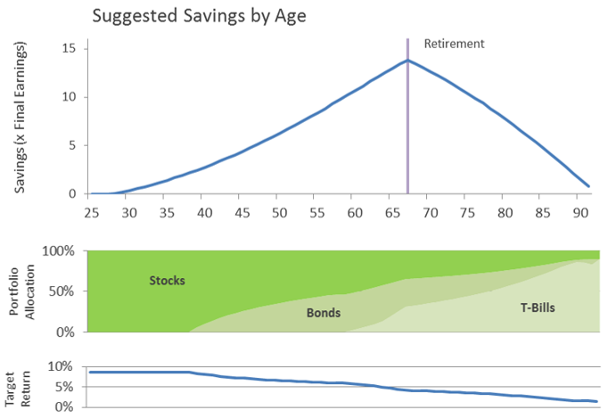
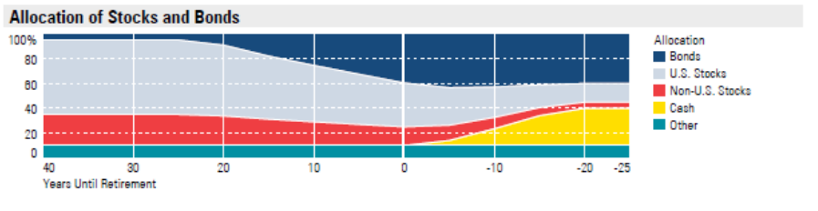
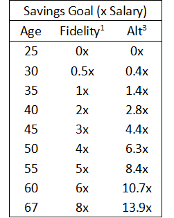

## Overview

After graduating from UC with a degree in Business/Finance, I realized I still didn't have a lot of concrete advice for how to save money throughout my life in order to guarantee that I could retire comfortably at some point.  I knew that money should be invested in the stock market.  I knew that 10% was a typical goal for how much of your money you should save.  But what about the other numbers?  What is the target number I'm trying to hit in order to retire?  What is the probability of hitting it given my current savings?  And how should I allocate my investments to maximize my probability of hitting my goal?

To answer these questions, I put together an analysis method that looked at the goal of retiring and making sure you don't run out of money before you die.  The final objective is either a 1 or a 0: you live comfortably for the rest of your life, or you run out of money early and end up in a bad spot.  Working back from this final state, you can answer questions regarding the probability of successfully out-living your money given different retirement ages and starting bank balances.  This analysis recommended that your savings target be somewhere between 11-16 times your annual earnings at the time you retire.  The difference in these estimates comes from whether you expect Social Security to pay out at 100% or 50% of its current rate.  The savings targets should ensure a 99% probability of not out-living your money.  They are slightly higher than the 8x salary that Fidelity recommends.

Once we have this target we can continue to work backwards through time and determine what optimal portfolios look like along the way.  The analysis looks at 3 different investments: stocks, bonds, and t-bills, each earning different average rates of return.  The results confirm the typical wisdom of investing aggressively when you are young and moving into safer investments like bonds and t-bills over time as stability of principal becomes more important than earning large returns.  The following chart summarizes this:

Compare this with the diversification advice offered by Merrill Lynch:

The final result of this analysis is a set of savings targets by age:

These are expressed as multiples of your current salary.  With these goals in mind you can assess whether you are on track of not to meet your retirement goals.

## Attachments

* [Retirement-Savings.pdf](Retirement-Savings.pdf) - Summary Paper with Key Results
* [Optimized-Retirement-Portfolios.pdf](Optimized-Retirement-Portfolios.pdf) - Details of the Analysis Approach
