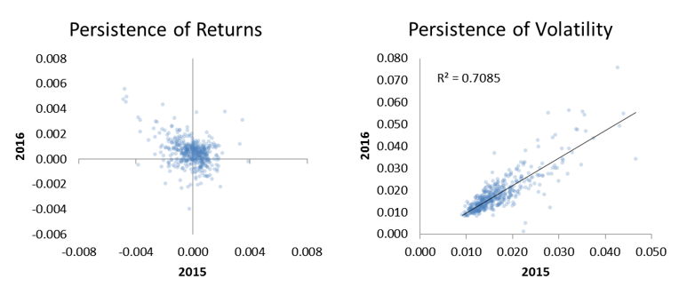

This paper starts with two questions:

* Do last year's stock returns predict next year's returns?
* Does last year's volatility predict next year's volatility?

Examining data from 2015 to 2016, we conclude that stock returns are not persistent from year to year. In fact, high returns one year are correlated with low returns the next year, and vice versa.  However, volatility is persistent.  A stock that is volatile one year is likely to be volatile the next year.  This is shown in the plot below:

We also look for correlations between risk and return to answer the questions:

1. Does higher volatility imply a higher return?
2. Does a higher beta imply a higher return?

We do not find any indication of this being true within this sample.

## Attachment

* [Persistence of Stock Returns and Volatility.pdf](20161023-Persistence-of-Stock-Returns-and-Volatility.pdf)
