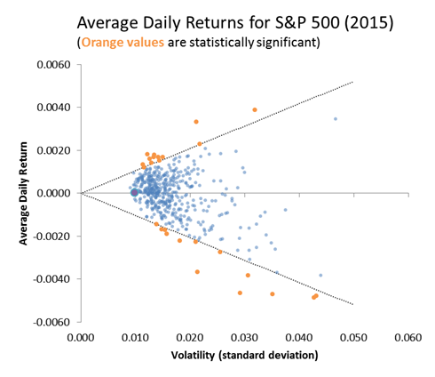
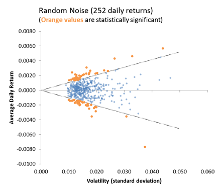
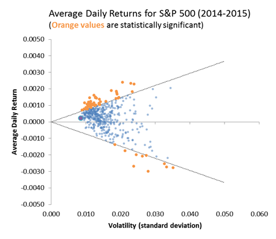
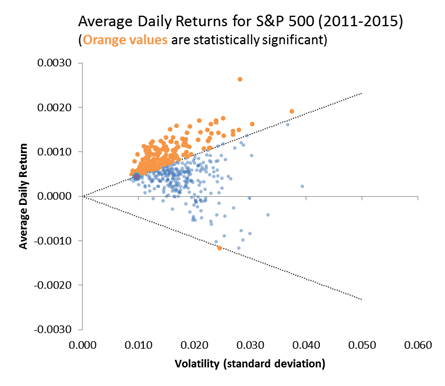

## Overview

The attached paper is an examination of whether stock returns are statistically significant.  That is, if you see a stock returns 8% one year, does that really mean anything?  [Prior analysis](20161003-persistance-of-stock-returns-and-volatility/) showed that stock returns are not persistent from year to year.  This analysis goes further and suggests that stock returns from a single year are essentially indistinguishable from random noise.

## Sample Charts

The chart below shows average daily stock returns versus standard deviations for 500 stocks in 2015:

Only 5% of these stocks had returns that were statistically significant using a p-value of 10%.  This is interesting because with p=10% we would expect 10% of the stocks to meet this criteria just due to randomness.

The chart below shows how random noise produces essentially the same plot, but with even more statistically significant results than what we see in the actual stock market:

If we extend the period of time we examine, we do start to see better signs of statistical significance.  The chart below shows average daily returns versus volatility over 2-years:

About 12% of returns are now marked as statistically significant, and most of these are on the positive side.

If we extend the period of time to 5-years 39% of stocks now have statistically significant returns:

The conclusion is that returns with a single year are indistinguishable from random noise.  What looks like a good stock with an 8% return might actually just be a stock that averages 0% over the long term but which had a good year.  Over longer time horizons, solid performers start to emerge, but a large percentage of the stock market still looks essentially like random noise.

## Attachments

* [Statistical-Significance-of-Returns.pdf](20161024-Statistical-Significance-of-Returns.pdf)
