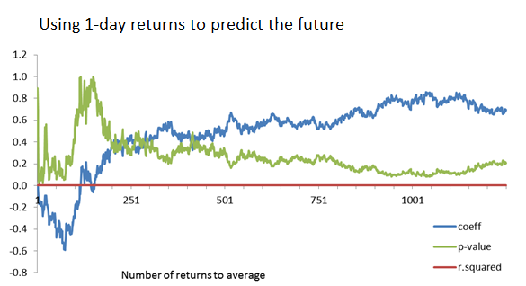
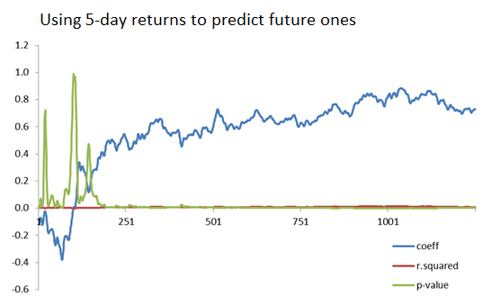
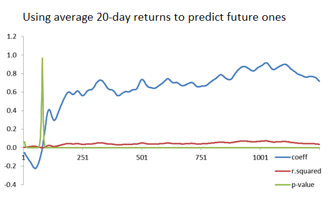
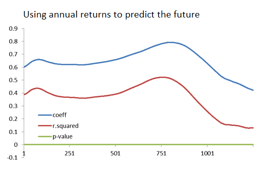

## Overview

This paper looks at the question: "Do past returns predict future results?".  We look at the S&P 500 and try to predict future results using past ones.  We do this by looking at average 1-day returns to predict the next day's returns, average 5-day returns to predict the next 5-day return, and do the same for 20-day (monthly) and 250-day (annual) returns.  We also look at how much history we should use in our model when calculating these averages, as that definitely has a factor on the result.

## Key Charts

The chart below shows the results for 1-day returns:

We see that:

* R-squared is always near zero (none of the models are good)
* P-value for the regression is typically above 10% (no models are even statistically significant)

At the 5-day chart we see:

* R-squared is still bad
* P-values are now statistically significant for many models
* While a positive correlation exists in the long-term (using 1-year or more of historical data), an inverse correlation exists if we just average returns over the past couple of months.

At the 20-day chart we see:

* R-squared is starting to improve (but is still bad)
* The long-term positive correlation and short-term negative correlation features still persist

And for 250-day returns we see:

* R-squared is finally improving to about the 0.4 level
* There is a positive correlation in returns, but it is not 1-to-1 (the coefficient moves between 0.6 and 0.8)

This tells us that past returns are pretty good predictors of the future, at least at the long-range level where you are looking at annual returns.  It's not a perfect predictor since there is naturally still variation in the market's returns.  Short-term returns actually show an inverse correlation where high returns in the short term might foretell lower corrective returns in the near future (and vice versa).

## Attachments

* [Do-Past-Returns-Predict-Future-Results.pdf](20170325-Do-Past-Returns-Predict-Future-Results.pdf)
