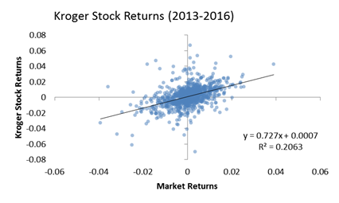
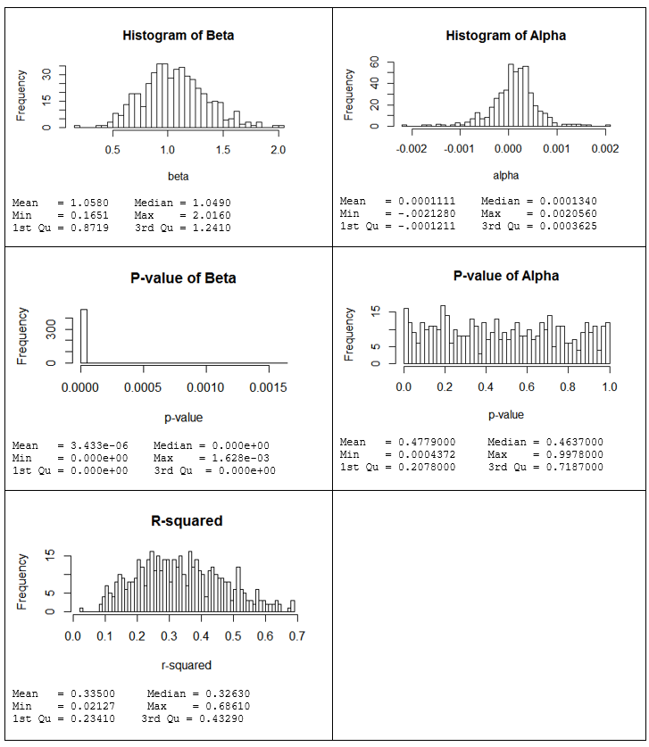

## Overview

This analysis performs the typical linear regression of individual stocks against a broader portfolio of stocks to determine alpha, beta, and measures assessing "goodness of fit" for these models (p-values for coefficients and the overall R-squared values).  The regression of a single stock looks like the following:

When we do this for all of the stocks in the S&P 500, we see the following results:

* The average value of beta is 1 (most stocks move with the market on a 1-for-1 basis), although some move more and others less.
* Values of alpha are close to zero (the theoretical prediction) but slightly positive.  Some stocks how much higher returns than can be explained by the market and others show much lower returns.
* P-values for beta are so low that we believe all stocks have some relation to the overall market.  Even the 3rd quartile (75% of stocks) are showing p-values so low that they are indistinguishable from zero.
* P-values for alpha are all over the place.  This implies that some excess returns are statistically significant, but the vast majority are not.  The uniform distribution of p-values may even cause us to question whether those with low P-values are significant.  It may just be that these low p-values are also the result of random chance.
* The R-squared average 0.335, implying that 33.5% of stock returns are explainable by movements of the market overall. Some are higher, and some are lower, but it is very rare to see stock’s that have less than 10% of their returns driven by the market overall.

This last point is the one that we are interested in.  (The rest just give us more confidence in the appropriateness of this model across a wide range of stocks.)  The average stock has 33.5% of the variance in its returns explained by movements in the overall market.  A confidence interval from 9.7% to 64.2% covers 98% of all stocks in this assessment.

## Attachments

* [20170423-Proportion-of-Stock-Returns-Due-to-Larger-Market-Movements.pdf](20170423-Proportion-of-Stock-Returns-Due-to-Larger-Market-Movements)
