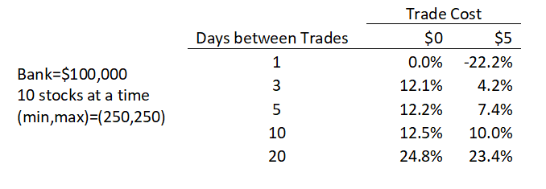
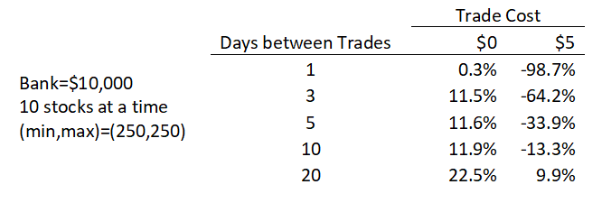
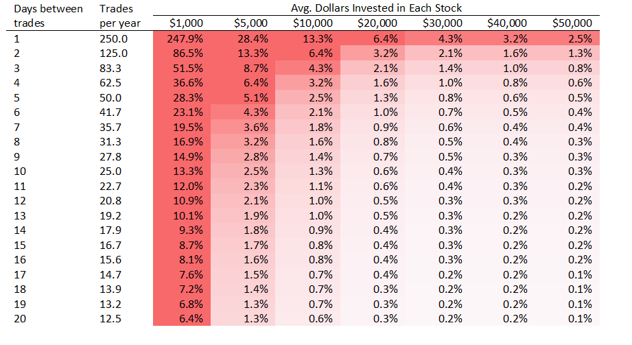

## Overview

The attached paper looks at a simple portfolio selection process that picks the top 10 stocks with the highest returns over some past period and invests in those.  The strategy performs very well, out-performing the market and even beating it on risk-adjusted measurements like the Sharpe and Sortino ratios.  However, trading costs can quickly destroy the profitability of this strategy.  The bulk of this paper is spent looking at the effects of trading costs and showing the value of trading less frequently when trading costs exist.

## Key Charts

The table below shows the return of the 10-stock portfolio and how that return is affected by 1) the number of days between portfolio changes, and 2) trading costs:

The next table is similar, but shows the results with a smaller bankroll ($10k instead of $100k).  This time the trading costs completely destroy the profitability of the strategy at all rebalancing frequencies except for 20 days.  Even in the absence of trading costs we see slightly diminished profits due to the "frictions" of trading.

Lastly, we show a chart that calculates the impact on your portfolio return of a $5 trading cost based on how frequently you trade and how much you invest in each stock.  The take-away from this chart is that you want to avoid trading too frequently and make sure you invest a large enough amount (about $10k per stock) to minimize the impact of trading costs on your portfolio.

## Attachments
