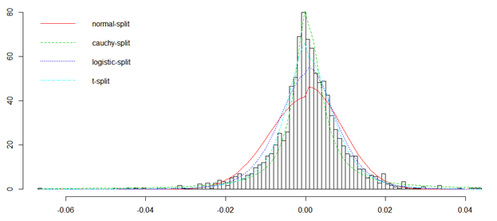

## Overview

The attached paper looks at different distributions that can be used to model a stock's returns.  The normal distribution, t-distribution, cauchy distribution, and logistic distributions are compared, and the t-distribution is shown to be superior.  We also look at using a "split" t-distribution where we model the upside and the downside using different parameters to capture their unique shapes and show how this improves fits in many cases.

The distributions are then used to predict option prices.  The predicted prices are compared with market prices and differences are discussed.

## Attachments

* [20170805-Modeling-Stock-Returns-and-Pricing-Options.pdf](20170805-Modeling-Stock-Returns-and-Pricing-Options.pdf)
