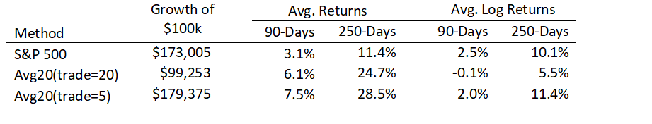
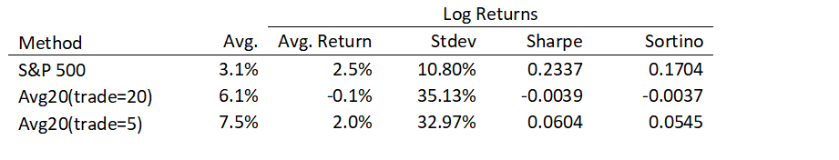

## Overview

The attached paper examines a portfolio selection strategy we discussed in an [earlier article](../20170512-simulated-trading-of-stock-portfolios/). This strategy selects the top N stocks based on prior performance and rebalances periodically.  While this strategy proved to be profitable before (at least, in the absence of trading costs), it does not retain this profitability when examined over a longer period of time.  Instead, we see that the strategy that trades every 20 days actually fails to outperform the market while the strategy that trades every 5 days barely succeeds in out-performing the market.

The table below provides more details:

We also see the importance of measuring log-returns rather than just taking simple averages of returns.  The simple average returns look pretty good for both strategies (outperforming the market significantly), but the log-returns show the true impact of what happens to the money you invest.

The next table looks at risk-adjusted metrics like the Sharpe and Sortino ratios and shows that both strategies fail to outperform the market on a risk-adjusted basis.

While there are periods of time where this strategy is highly profitable, there are also periods where it results in significant losses that can entirely wipe out any profits you made during the better periods.

## Attachments

* [20170812-Average-Return-Portfolio-over-10-Years.pdf](20170812-Average-Return-Portfolio-over-10-Years.pdf)
