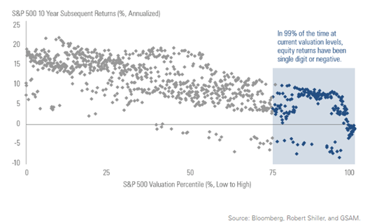
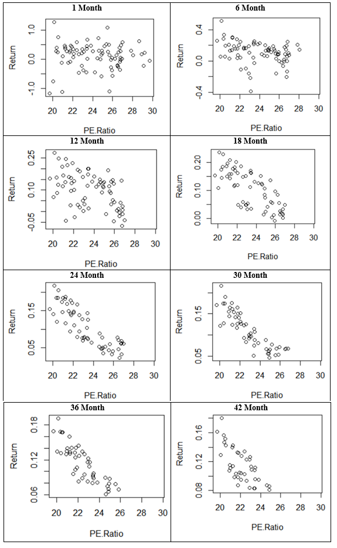
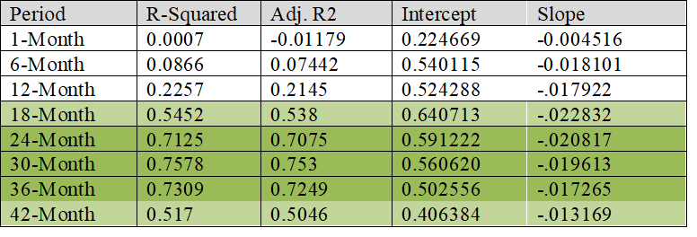

## Overview

This paper examines the relationship between the Shiller P/E Ratio and future returns on the S&P 500.  It was inspired by this chart from a [CNBC article](https://www.cnbc.com/2017/07/31/theres-a-99-percent-chance-stock-market-returns-will-be-subpar-from-here.html):

My own analysis dove deeper into these results, looking at different return horizons to see where this model was most applicable. As seen in the charts below, the relationship is strongest when predict 24-month, 30-month, 36-month, and 42-month results.

The exact results of the regression along with the R-squared for each of the time horizons is shown below:

At the current P/E levels of 28.96 these models would predict the following future-looking returns:

* 18-month: -4.11%
* 24-month: -3.04%
* 30-month: -2.50%
* 36-month: -1.30%
* 42-month: -1.32%

Despite being very simple, this may be one of the more important analyses I have ever done.

## Attachments

[20170813-PE-Ratios-and-SP500-Returns.pdf](20170813-PE-Ratios-and-SP500-Returns.pdf)
