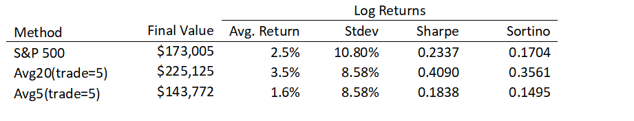

## Overview

This paper revisits a strategy we looked at earlier where we build a portfolio of the best-performing stocks historically and hope they will continue to perform well.  In the past, this failed to produce sustainable results, especially on a risk-adjusted basis.  This time we modify our selection criteria to limit the amount of risk we take on.  We find the stocks with the highest historical return whose standard deviation and lower partial moment (the denominators in the Sharpe and Sortino ratios) do not exceed those of the market.

This new strategy produces vastly improved results as shown in the table below:

The table shows that one strategy (looking at 20-day returns) succeeds in outperforming the market both in terms of average returns and the risk-adjusted returns.  The strategy that looks at 5-day returns does not out-perform the market.

## Attachments

* [20170904-Limiting-Risk-in-Stock-Selection.pdf](20170904-Limiting-Risk-in-Stock-Selection.pdf)
