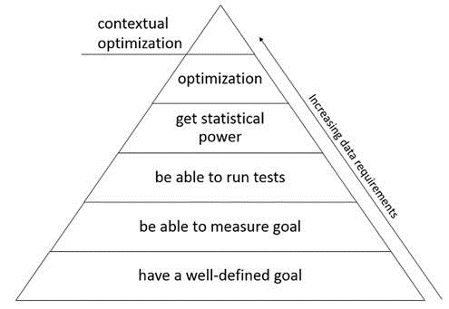

A while back I read an article about data science needs that really stuck with me.  The image below is the "Unconjoined Triangle of Data Science" by Sean Taylor.  ("Unconjoined Triangle" is a joke from the show Silicon Valley, and if you haven't watched it, you should.)

Companies need to make sure they have a solid foundation in the bottom two layers before progressing up to the 3rd and the 4th.  However, there is a great desire to jump all the way to the top with optimization, machine learning, and prescriptive analytics.  It is important to lay a strong foundation though or your pyramid will tumble.  I'm going to print this out and put it on the wall to remind myself to spend more time in the bottom layers, building a strong foundation for success.  To do this we need:

* __Well-defined goals__ - what are we trying to accomplish and why?
* __Ability to measure the goal__ - solid KPIs, reports, and dashboards that allow us to reliably track activity and progress (this is usually what most projects are lacking)
* __Ability to run tests__ - this is also something we frequently compromise on, either running too many tests at the same time (so you don't know which one is contributing to your success) or removing the time for tests altogether and rushing to roll out something fast.
* __Statistical power__ - data science teams spend time here, but it doesn't mean much if you don't have good data or well-planned tests
* __Optimization, machine learning, prescriptive analytics__ - where we want to be, but again: we will never get here without the previous foundation.  You simply need to have good measurements, dashboards, diagnostic reports, and a good understanding of the test-and-learn process if you ever want to get here and have a machine start to automate decisions for you.

I've run through this complete process a couple of times in my career.  Once with the DC Forecasting team where we built really great dashboards to understand how our forecasting system was functioning and measuring the impact of different changes/tests.  We only climbed the first 3 layers of this pyramid, but even that made a huge difference in our operations!  Another project with this team working on optimizing a blended forecast climbs a couple steps higher.  It is promising work, and very satisfying to know that our results are based on solid, statistical tests and inferences.  We do still have some data problems - just like every other project - and that is where the pyramid tends to get weakest.  I start to feel a little insecure about all analytical results when they might be based on data with poor quality.  Improving our ability to measure our business with good data, and reliable metrics is still the biggest opportunity for many companies.
