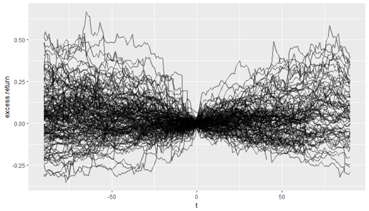
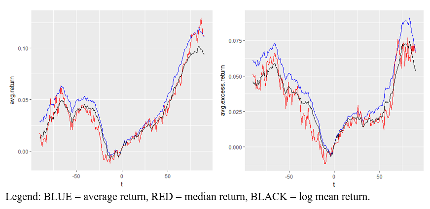

## Overview

The attached paper looks at companies that announced stock repurchases to see how these activities affected the stock price.  167 stocks were examined.  While their individual returns look like a bunch of spaghetti:

The average returns over these stocks actually do show a good trend:

On average, stocks fall about 5% before the repurchase is announced.  (This makes sense because companies will want to buy back their stock only if it is trading less than what they believe is a fair value.)  After the repurchase is announced, the stock tends to increase 5% after 50 days and a 10-15% return after 90 days (2.5% and 7.5% on a market-adjusted basis).

Looking for stock repurchase announcements and buying those stocks could prove to be a valuable strategy.

## Attachments

* [20180915-Do-Stock-Repurchases-Increase-Future-Returns.pdf](20180915-Do-Stock-Repurchases-Increase-Future-Returns.pdf)
