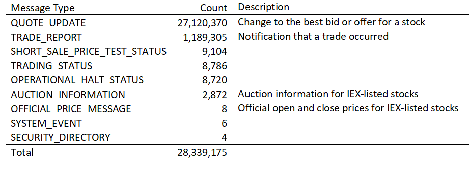
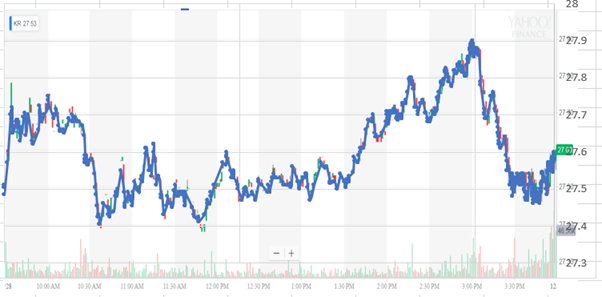

## Overview

The IEX exchange provides binary data files with detailed trade information for free.  These include the following types of messages:

The 1.2 million trade report messages represent 2% of the total stock market trading activity for the day.

A breakdown of trades by stock shows that we have enough trades for the highest moving stocks to basically get minute-level data for approximately 500-1000 stocks.  Data for Kroger is pulled and overlayed with minute level data from Yahoo! Finance.  The chart below shows that the IEX data contains enough information to essentially capture all of the minute-level activity in this stock:

When digging into the order book feed we found that this information is not quite as valuable.  Less than half of the trades that occur on the IEX exchange hit the IEX order book.  Instead, IEX offers trade types that will execute at the NBBO (National Best Bid or Offer) prices for a stock.  The majority of their trades appear to be of this type.  These buy and sell orders are not shown in the order book when they are placed.  We only see a notification when they execute.

## Attachments

* [20181231-IEX-Intraday-Data.pdf](20181231-IEX-Intraday-Data.pdf)
