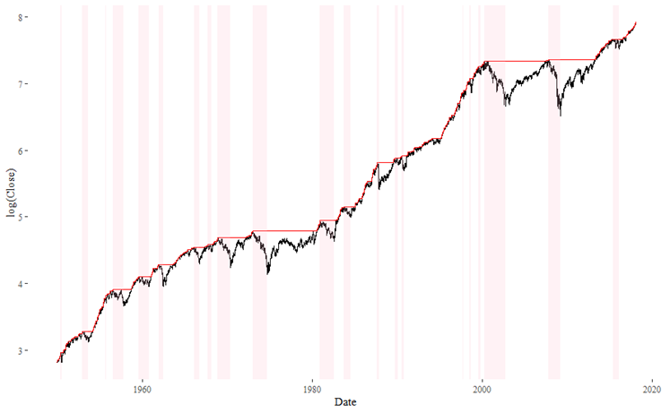
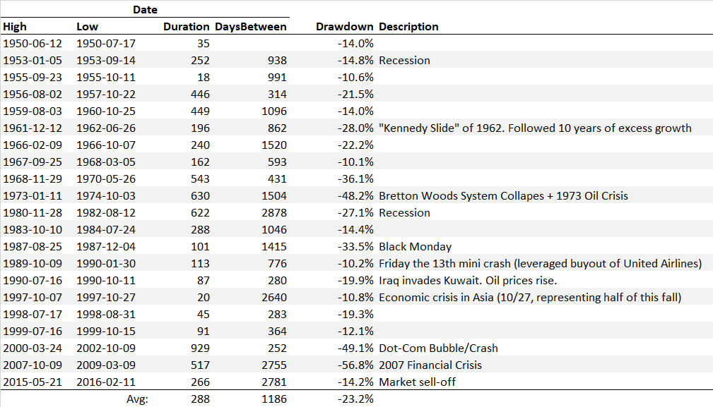

## Overview

Large stock market drawdowns occur all the time.  The chart below shows the S&P 500 over the past 70 years:

The shaded periods indicate drawdowns where the market fell by 10% or more.  Each of these drawdown periods is detailed in the next table:

On average, a drawdown of this size occurs every 1,187 days (4.74 years).  They can occur as little as a year apart or as much as 12 years.  But the overall message is: these are not rare occurrences.  In fact, they occur quite frequently and can wipe out multiple years of profits all at once.

## Links

* [Wikipedia - List of Stock Market Crashes and Bear Markets](https://en.wikipedia.org/wiki/List_of_stock_market_crashes_and_bear_markets)
