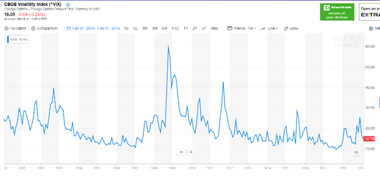

## Overview

The attached paper looks at market volatility and tries to find a way to predict and profit from what appear to be regularly occurring increases.  The basic idea is that when volatility is low, we can buy put and call options that will increase in value when volatility spikes.  The big question then is whether we can predict whether volatility will increase within the time period before the options expire.

The analysis lacks actual options data, so it tries to simulate it.  The results look promising.

UPDATE: Trying to actually execute this strategy revealed that the long-range options do not respond to short-range volatility as much as we expected.  While short-range volatility may increase, long-dated options did not show this same increase, implying that traders expect the increases to only be short-term effects and for long-term volatility to remain relatively smooth.  This eliminated the expected returns from the proposed trading method.

## Attachments

* [20190309-Predicting-and-Profiting-from-increasing-Market-Volatility.pdf](20190309-Predicting-and-Profiting-from-increasing-Market-Volatility.pdf)
