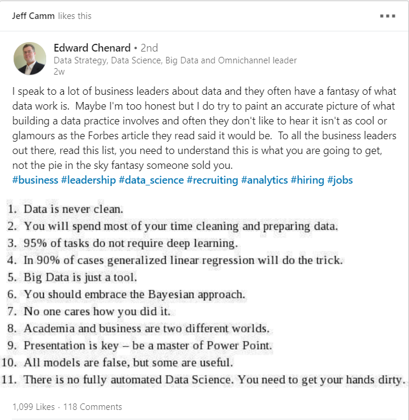

I saw this post on LinkedIn the other day and have been thinking about how true it is.  My favorite part: in 90% of cases generalized linear regression will do the trick.  This makes me feel a lot better about just how often I use it myself!

To make it easier to copy/paste:

1. Data is never clean.
2. You will spend most of your time cleaning and preparing data.
3. 95% of tasks do not require deep learning.
4. In 90% of cases generalized linear regression will do the trick.
5. Big Data is just a tool.
6. No one cares how you did it.
7. Academia and business are two different worlds.
8. Presentation is key - be a master of Power Point.
9. All models are false, but some are useful.
10. There is no fully automated Data Science.  You need to get your hands dirty.

While I'm at it, I also came across this interesting article from Nature:

* [Scientists rise up against statistical significance](https://www.nature.com/articles/d41586-019-00857-9)

It argues that about 50% of scientists have come to believe that lack of statistical significance means the absence of any effect.  The authors argue that this is an incorrect conclusion.  A result that differs from zero (or a null hypothesis) but lacks statistical significance could still very well be correct - and may even likely be so.  It just is not statistically provable.  More data or a different method of investigation is required to get more precise estimates that are statistically significant.  I know I've made this mistake a few times myself.  Just the other day in fact: when I said our model showed a negative project benefit, but downplayed it by saying it wasn't statistically significant.  Next time; I'll say that our best estimate is that we have a negative impact, but additional data is required to be certain.
