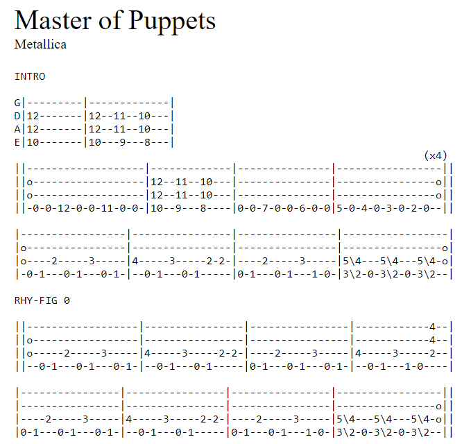

## Overview

Guitar tabs are simple documents: they can be stored in simple ".txt" files and as long as you render them with a monospace font, they look good.  As such, they are ideal candidates for a statically-generated website that transforms simple text files into HTML.

Now, I'll be the first to admit: the site that I built is not all that pretty.  It's a plain, simple bare bones site where I didn't do hardly anything to add any styling to these files at all.  As such, Metalsmith was a great choice for building the site.  Metalsmith is a bare-bones framework for processing input files (typically text or markdown) and outputting HTML files for your website.  It doesn't make hardly any assumptions about what types of files you have and it doesn't provide a lot of help in producing pretty websites.  It leaves that to you.  What it does provide is a simple, elegant transformation pipeline written in JavaScript that handles the basic operations of the transformation and can automate a lot of the details for you.

## Project Layout

My project layout looks like this:

```
layouts/
  song.html
  song_index.html
public/
  css/
    main.css
  js/
    react-components.js
src/
  songs/
    3 Doors Down - Down Poison.md
    3 Doors Down - Duck and Run.md
    ...
README.md
build.js
package.json
```

## The Guitar Tabs

My guitar tabs are all stored in ```src/songs``` in Markdown files.  These files look like this:

````
---
title: Master of Puppets
artist: Metallica
---

```
INTRO

G|---------|-------------|
D|12-------|12--11--10---|
A|12-------|12--11--10---|
E|10-------|10---9---8---|
                                                                  (x4)
||-------------------|-------------|---------------|-----------------||
||o------------------|12--11--10---|---------------|----------------o||
||o------------------|12--11--10---|---------------|----------------o||
||-0-0-12-0-0-11-0-0-|10--9---8----|0-0-7-0-0-6-0-0|5-0-4-0-3-0-2-0--||

...
```
````

I put the song title and artist into the frontmatter, to make them easy to extract and build index pages with all artists and songs.  The bulk of the file itself is then enclosed in backticks so that it renders as pre-formatted text when viewed as a Markdown file.

## HTML Templates

My goal was to produce two types of output files.  There is a template for each one in the "layouts" folder:

- ___song.html___ - A single song page
- ___song_index.html___ - A list of all songs

The "song.html" site is pretty easy.  The main part of the file looks like this:

```
<div class="main-content">

  <header class="song-header">
    <div class="song-title">{{ title }}</div>
    <div class="song-artist">{{ artist }}</div>
  </header>

  {{{ contents }}}

</div>
```

You can see that page data is simply inserted into the HTML in the double or tripple brackets.

The song_index.html page was a little harder, but only because I decided to use React.  The main section of this file is:

```
<div class="main-content">
  <div id="song-list"></div>
</div>

<script src="https://unpkg.com/react@16/umd/react.production.min.js" crossorigin></script>
<script src="https://unpkg.com/react-dom@16/umd/react-dom.production.min.js" crossorigin></script>

<!-- Load our React components. -->
<script src="js/react-components.js"></script>
<script type="text/javascript">
  const domContainer = document.querySelector('#song-list');
  ReactDOM.render(React.createElement(SongTable, {songs: SONG_DATA}), domContainer);
</script>
```

In this case the JSON data "SONG_DATA" is passed to React, and we handle the HTML rendering of that data there.

## build.js

The real "magic" of Metalsmith takes place in the "build.js" file.  This is a tricky file, so let's walk through it one piece at a time.

First, we include a lot of dependencies.  The core 'metalsmith' library doesn't do much besides provide the basic processing pipelines.  If we want to convert Markdown to HTML we will need 'metalsmith-markdown'.  If we want to use HTML layouts we need 'metalsmith-layouts'.  If you want to copy assets from an input folder to an output folder you need 'metalsmith-assets'.  Each library does one thing, keeping things simple, but also requiring you to know about these core libraries that you need to build any kind of meaningful project.

```
var Metalsmith    = require('metalsmith');
var markdown      = require('metalsmith-markdown');
var layouts       = require('metalsmith-layouts');
var permalinks    = require('metalsmith-permalinks');
var writemetadata = require('metalsmith-writemetadata');
var assets        = require('metalsmith-assets');
```

Next, we define some user-specific functions, but I'll skip those for now.

The last thing we do is invoke the Metalsmith build pipeline:

```
Metalsmith(__dirname)
  .metadata({
    siteTitle: "Dan's Guitar Tabs"
  })
  .source('./src')
  .destination('./build')
  .clean(true)
  .use(removeFiles(["songs\\_template.md"]))
  .use(removeSpaces())
  .use(validateTabs())
  .use(markdown())
  .use(writeIndex())
  .use(layouts({
    engine: 'handlebars',
    default: 'song.html'
  }))
  .use(assets({
    source: './public',
    destination: '.'
  }))
  .build(function(err, files) {
    if (err) { throw err; }
  });
```

This pipeline specifies everything.  It indicates the source directory ('./src') and the output directory of our build ('./build').  It specifies some site metadata (for later use) and instructs the build to clean the output directory before getting started.

The various "use" functions invoke my custom functions as well as some of the imported libraries.  Each function is described below:

- ___removeFiles___ - My function.  Removes files from the build pipeline that I don't want rendered into song pages.
- ___removeSpaces___ - My function. Removes spaces in file names, replacing them with dashes.
- ___validateTabs___ - My function. Ensures guitar tab files have both the "title" and "artist" frontmatter (or logs a warning)
- ___markdown___ - Third party. Converts markdown files to HTML
- ___writeIndex___ - My function. Creates a new file, "index.html", that lists all songs
- ___layouts___ - Apply layout templates to content
- ___assets___ - Copy static files from 'public' to build directory

Once this pipeline is defined, we call "build()" to invoke it.

Most of the functions I wrote are self-explanatory, but lets take a peak at one of them, the ```writeIndex()``` function.  This is below:

```
writeIndex = function() {
  return function(files, metalsmith, done) {
    setImmediate(done);

    var songData = [];
    Object.keys(files).forEach(function(file) {
      var data = files[file];
      var info = {
        title: data.title,
        artist: data.artist,
        link: file,
        tuning: data.tuning,
        rating: data.rating,
        difficulty: data.difficulty
      };
      songData.push(info);
    });

    files["index.html"] = {
      title: "Song Index",
      layout: "song_index.html",
      songData: JSON.stringify(songData),
      contents: Buffer.from("This page does not have content")
    }
  }
}
```

The interesting thing about Metalsmith is that all of the files it is working on are stored in a map/dict called "files".  These are passed into each function, allowing the functions to modify the list of files as desired.  This makes it easy to delete files, rename them, transform their contents, etc.. In this case, we are going to read through all the files that are about to be created (which in this case are all song files), extract metadata from them including the title, artist, and link to the file, and store this info in a list.

At the end of the function we create a new file called "index.html" and provide a JSON object that will be used to construct the page.  In this case the JSON object will be injected into the layout file "song_index.html", which we saw earlier.

This is all it takes to generate a simple, static website using Metalsmith.  Our "package.json" file defines all the dependencies we need and lets us easily run our build script.  When we run ```npm build``` it will invoke ```node build.js``` and run the JavaScript build file.  That's pretty much all there is to it!

```
{
  "name": "static-site-example",
  "private": true,
  "dependencies": {
    "express": "^4.17.1",
    "handlebars": "^4.0.5",
    "metalsmith": "^2.1.0",
    "metalsmith-assets": "^0.1.0",
    "metalsmith-layouts": "^1.4.1",
    "metalsmith-markdown": "^0.2.1",
    "metalsmith-permalinks": "^0.5.0",
    "metalsmith-writemetadata": "^0.4.5"
  },
  "scripts": {
    "build": "node build.js",
    "start": "node server.js"
  }
}
```

## Automated Website Deployment

One additional feature I added to this website was an automated build and deployment using GitHub actions.  [This article](https://alexwilson.tech/blog/2020/01/15/deploying-static-sites-with-github-actions/) showed me how to do that.

You can look at the code in https://github.com/bodhi-root/guitar-tabs/tree/master/.github to see how this done.  It consists of workflow that will trigger whenever someone commits code to the master branch of the repository.  This will:

1. Checkout out the new code
2. Use "npm" commands to install dependencies and build your website
3. Push the new code to the "gh-pages" branch of your repository

This last step uses a custom docker image based on "alpine/git".  This code should be pretty re-usable for any node-based website that basically just installs dependencies and runs "npm build".
