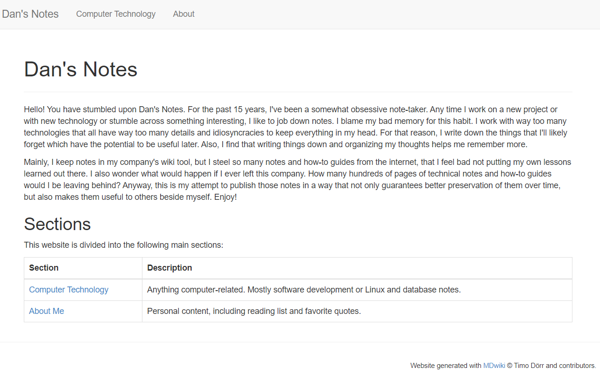
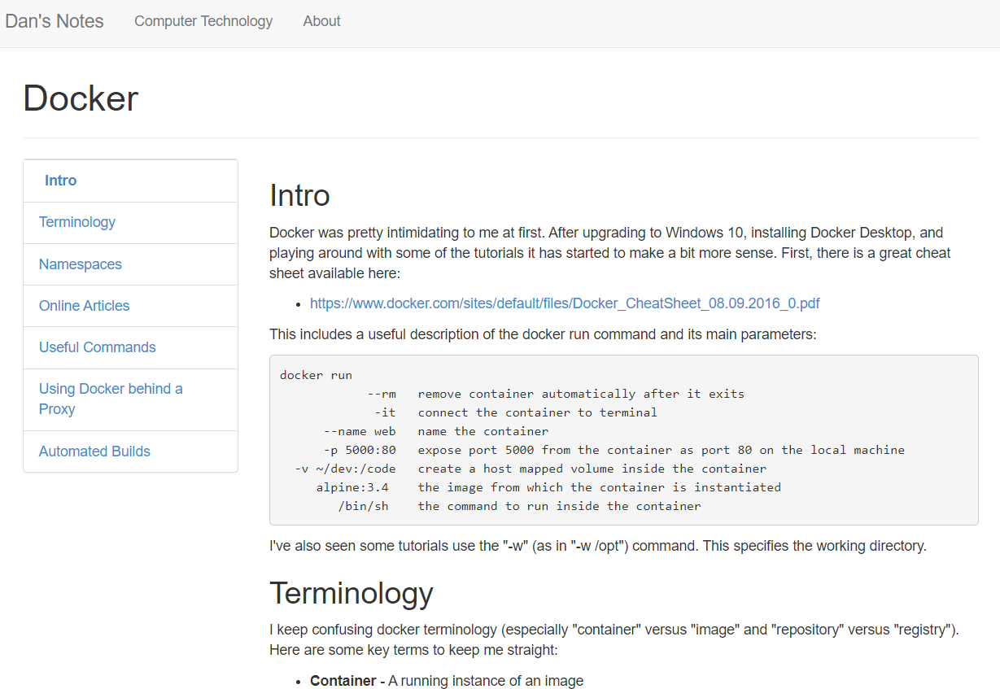
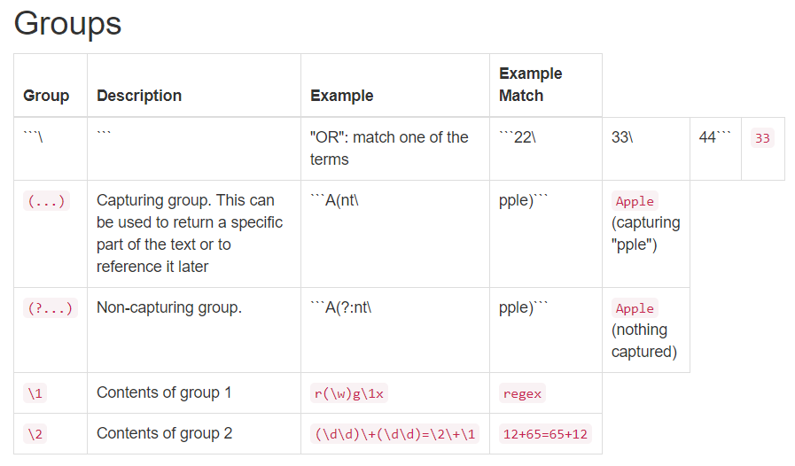

## Motivation

For the past 20 years or so I've been an obsessive note-taker.  Mostly, I take notes on my company's internal wiki where I have at least 100 pages of notes on various technologies or things I've learned over the years.  I always have this little worry in the back of my head though: what if they walk me out the door one day and I lose access to all of that?  All my notes about building websites or data science projects and deploying services in GCP and Azure.  I'd have to essentially learn all of that again.  For this reason, I've been wanting to start a simple wiki-like collection of notes in Markdown format that I could not only take with me when I do leave the company (hopefully when I retire a good many years from now) but also share with others outside of the company.  After all, almost everything in these notes was scraped off the internet from the thousands of other professionals out there who were kind enough to share their notes.

## Technical Details

In this effort I stumbled across a great little project called [MDWiki](https://github.com/Dynalon/mdwiki).  To use this project, you simply copy one file, index.html, into your local directory and that one file magically creates a website for you from your Markdown files.  If I remember right, the "index.html" file contained in the GitHub repo and in their list of previous versions were both broken, and didn't work for me.  But you can guarantee you get a good working copy by downloading "index.html" from their working website: http://dynalon.github.io/mdwiki/#!index.md.

My project layout looked like this:

```
www/
  computer-technology/
    assets/
      ... images and such ...
    docker.md
    index.md
    git.md
    ...
  personal/
    index.html
    ...
  index.html
  index.md
  navigation.md

README.md
```

The entire website is in the "www" folder (to keep it separate from project-level resources like README.md).  When you navigate to "index.html" it automatically searches for "index.md", converts that from Markdown to HTML, and returns it.  "index.md" can contain links to other files, such as "computer-technology/index.md" or "computer-technology/docker.md".  The links are entered just like that: relative links that include the ".md" suffix.  Any link in your page that looks like this will be converted to a link of the form: "#!computer-technology/docker.md".  The means you are always hitting the "index.html" page, but with a different value after the anchor sign.  "index.html" uses this information to pull the relative page, convert it to HTML, and return it.  The conversion is done on-demand, which means it will be a touch slower than statically-generated site that does all the conversion beforehand, but in practice I didn't notice any lag.  The transformation was essentially instantaneous.

The rendered website looks something like this:



As you can see, the default page template also builds a page index on the left side using any level 2 headings from your document.

The header bar is built from a special file named "navigation.md".  For the example above this file is simply:

```
# Dan's Notes

[Computer Technology](computer-technology/index.md)
[About](personal/index.md)
```

This file provides a site title and links for the header bar.

And that's really all there is to it.  You can commit this project to GitHub and setup a GitHub Pages site in a matter of minutes.  You can actually commit your site very easily to the "gh-pages" branch in GitHub by running:

```
git subtree push --prefix www origin gh-pages
```

This will push everything in the "www" directory up to the "gh-pages" branch as an independent project. This can be done because everything in the "www" directory is already in version control.  (Most statically-generated websites build into a directory that is on the '.gitignore' list, making deployment a bit trickier.)

## Running the Website Locally

NOTE: This requires Node/NPM to be installed.

If you want to see what your website looks like locally before deploying it, you can use a simple NodeJS script that runs a minimal server.  I took the code from [this blog post](https://blog.kevinchisholm.com/javascript/node-js/express-static-web-server-in-five-minutes/).  You start by creating JavaScript file that looks like this:

```
var express = require('express'),
  path = require('path'),
  app = express();

//set the port
app.set('port', 3000);

//tell express that we want to use the www folder
//for our static assets
app.use(express.static(path.join(__dirname, '../www')));

// Listen for requests
var server = app.listen(app.get('port'), function () {
  console.log('The server is running on http://localhost:' + app.get('port'));
});
```

Name the file "app.js" and put it into a directory named "web-server".  This does require some dependencies, so you'll need a "package.json" file that looks like this:

```
{
  "name": "node-express-static-web-server",
  "version": "1.0.0",
  "description": "Node Express Static Web Server",
  "scripts": {
    "start": "node web-server/app.js"
  },
  "author": "Kevin Chisholm",
  "license": "MIT",
  "dependencies": {
    "express": "4.13.3"
  }
}
```

You can run ```npm init``` to intialize the dependencies.  You can then start your local server by running:

```
npm start
```

## Final Comments

As much as I liked MDWiki as a fast, simple way to create a web site from Markdown files, I ended up not using this for my final website.  Instead, I fell in love with [this template](https://www.gatsbyjs.com/starters/hasura/gatsby-gitbook-starter/) using Gatsby which looks a heck-of-a-lot better and automatically generates a site index and sidebar to navigate the website.  This looks a lot more professional and a lot more like the wiki I use at work.

I also noticed at least one problem with MDWiki's Markdown converter.  My page on regular expressions had the following markdown:

```
## Groups

| Group        | Description | Example | Example Match |
|--------------|-------------|---------|---------------|
| ```\|```      | "OR": match one of the terms |	```22\|33\|44``` | ```33``` |
| ```(...)```  | Capturing group.  This can be used to return a specific part of the text or to reference it later | ```A(nt\|pple)``` | ```Apple``` (capturing "pple") |
| ```(?...)``` | Non-capturing group.	| ```A(?:nt\|pple)``` | ```Apple``` (nothing captured) |
| ```\1```     | Contents of group 1	| ```r(\w)g\1x``` | ```regex``` |
| ```\2```     | Contents of group 2	| ```(\d\d)\+(\d\d)=\2\+\1``` | ```12+65=65+12``` |
```

The  markdown converter got confused by the escape slashes and the pipes and ended up displaying the table like this:



The table renders perfectly well on GitHub's markdown view and on Gatsby markdown sites.

This could probably be remedied easily by upgrading the converter that the project uses.  The somewhat bland style could also be improved relatively easily.

At the end of the day I think I still might end up using MDWiki for another project: a private wiki-like site that I would like to create where I am the only intended audience.  The purpose of this site would not to be pretty, but rather to create a quick way for me to take notes on things like cloud project setup or even to store secret passwords and keys.  Markdown would probably suffice for that, but dropping the MDWiki "index.html" page in there would automatically build me a pretty good-looking site too.  In this case, I'd either run the site locally on my computer or perhaps upload it to a secure Google Cloud Storage bucket (one that requires Google authentication to view its contents).  The latter would create a website that only I could see and which provides a way to lookup various administrative information that I wouldn't want others to know.  This is not the type of information that I would ever want to upload to a git repository though.

Due to the potential usefulness of this in the future, I kept everything in a GitHub repo available at: https://github.com/bodhi-root/simple-wiki.
