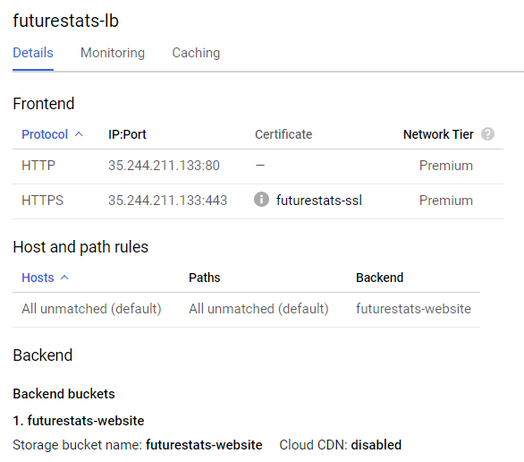
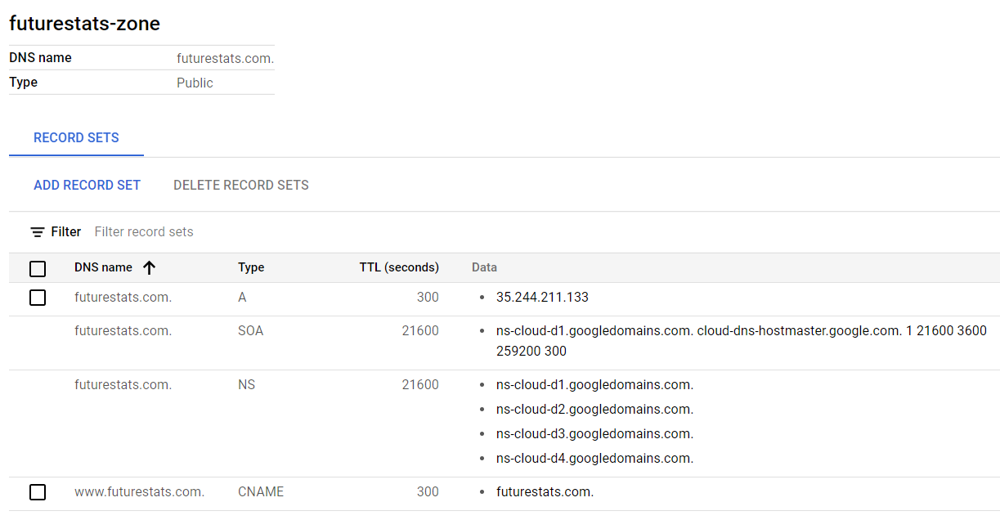

## Motivation

My first public website (futurestats.com) was built out of jealousy after my brother showed me his website [predictivestatmech.org](https://www.predictivestatmech.org/).  I mainly wanted a place to post articles on topics like software development, finance, and statistics - kind of like a blog.  I also wanted to store some wiki-like content with lots of technical notes and references, but this didn't really fit into the blog pattern so I dropped it as an immediate requirement. I ended up building the site using WordPress and deploying it on a small, micro-tier, Amazon Web Service instance.  I created a total of 1 blog post on this site and never really did anything with it.  In fact, I think if you went deep enough in one page you'd still find pictures of sandwiches from the original WordPress template I used.

Later, I ended up creating a Confluence wiki through [Atlassian](http://www.atlassian.com). This actually met my needs really well, allowing me to create new pages for my finance content and even allowing me to restrict access to pages based on individual users or groups.  I upload my guitar tabs, some of my college transcripts and class notes.  And then one day after a few month lull I went in to look at the site only to find it had disappeared.  I had recently moved and my change-of-address caused my credit card to be denied when Atlassian renewed my subscription.  They emailed me three times warning me they were going to delete the site, but I'm not great at checking email, so delete it they did.  When I finally emailed support and asked if the site could be restored they said it was gone.

This helped reinforce the desire for me to have my website stored in a non-proprietary format, hopefully a free one, that I could manage and even keep version controlled in GitHub or GitLab.  I did still go back-and-forth about whether I really needed to mess with static site generators or whether I could just go back to using WordPress - a tool which runs 30% of the internet and makes things really easy for content editors and admins.  However, I recently learned that I lost my login information for my WordPress site.  Apparently, I had those credentials in a text file that somehow missed the bus as I burned through 3 laptops one year and didn't get copied over with all the other files.  On top of this, I lost the private key that allows me to login to the AWS instance hosting my WordPress site.  Now, there are recovery methods, but it turns out the Ubuntu version I was running is no longer supported, so I'd not only have to go through the process of building a new machine and mounting the old hard drive on it, I'd have to do it for an unsupported OS and WordPress installation that I would need to upgrade immediately after the recovery.

So, in short, the advantages of a statically generated website/blog to host futurestats.com were:

- Hosting a static website is easier and cheaper than something like WordPress:
  - No need to run a VM to host WordPress and its associated database
  - No need to upgrade operating systems or WordPress versions
- My content would be stored in plain markdown rather than a proprietary database
  - This means it can be version controlled in a place where I'm pretty sure I won't lose my access/password
  - It can be easily migrated to a new frontend or template in the future
  - No one will delete my content if I don't pay my bill on time

After trying Jekyll, Metalsmith, and Gatsby I finally came around to using Gatsby for my site.  I like that it is based on JavaScript/React and doesn't require any weird Ruby installation.  It also comes with a variety of templates for your sites.  Unfortunately, I haven't found the templates to be that easy to use.  They're either too simple and don't provide enough features or way too complex with so many configuration options and complex code that I have a hard time getting started with them.  I ended up starting from my own HTML website template and adding in feature from the gatsby-starter-blog and other sites.  This page will document the high-level process I used to create this site as well as the main things I added or changed from the templates.  It also will discuss how I deployed the site through Google Cloud.

## HTML Template

None of the Gatsby templates were really working out for me.  The template I liked the most was actually built using simple HTML and a WordPress theme:

* https://startbootstrap.com/previews/modern-business

I downloaded this and kept all of its pages as-is in a directory named "template".  I then started converting the main pages I needed into React/Gatsby form under the "src" directory.  My initial project structure looked like this:

```
src/
  components/
    Footer.js
    Layout.js
    MainNavBar.js
  pages/
    about.js
    blog.js
    index.js
  styles/
    ...
static/
  images/
    ...
  favicon.ico
gatsby-browser.js
gatsby-config.js
gatsby-node.js
package.json
README.md
```

Translating these projects from HTML to React reminded me of just why React is so awesome.  Whereas the original templates had to re-create the entire page layout, header, footer, and all on every single page, these could be refactored into re-usable components in React.  The "Layout.js" component automatically builds the basic page, including the header, footer, and a placeholder for the main content that every page can then use simply by returning its content as:

```
return(
  <Layout>
    ...
  </Layout>
);
```

The pages themselves also had many sub-components such as BlogEntries that could be repeated on the main blog page or other elements that were refactored out of the main content so they could easily be re-used and repeated or just because they were complicated and it was easier to put them into their own component and then reference them in the main page.

This led to pages that were as easy to read and maintain as the blog index page:

```
<Layout>
  <div className="container">
    <TitleRow tag={tag} />
    <div className="row">
      <div className="col-md-8">
        <h4>{data.allMarkdownRemark.totalCount} Posts</h4>
      </div>
      <div className="col-md-8">
        <hr />
        <BlogEntries nodes={data.allMarkdownRemark.edges} />
      </div>
      <BlogSidebar />
    </div>
  </div>
</Layout>
```

Don't you just love the re-usability and component-driven design of React?  I only ended up creating 3 pages (index, about, and blog), but I had half a mind to go through the entire template and re-write it in React.  I'm sure that would be valuable to someone, but I did a good job of not sliding off on that tangent like I usually do and focusing on what I was hoping to accomplish personally.

## Blog Posts

The primary part of the site that involves dynamic content is the blog portion.  The goal here is to be able to easily add new blog posts as markdown files and have these automatically rendered into HTML pages and picked up by tools that build the blog index pages and tag index pages.  The main portion of the blog was built using the [Gatsby Tutorial](https://www.gatsbyjs.com/docs/tutorial/) which describes how to build exactly this type of blog and the [Gatsby starter blog](https://github.com/gatsbyjs/gatsby-starter-blog) which helps refactor the blog content out into its own "content/blog" folder and separate posts into their own directories. Between the two of these pages I could convert my markdown files to HTML and include them in a blog index.

Neither of these starter sites included functionality for tagging posts and then building:

1. Index pages listing all the articles for blog posts with a given tag
2. A list of all tags used in the site with links to the tag index page

For this functionality I had to rely on [this tutorial](https://dennytek.com/blog/personal-site-with-gatsby-part-7) which was very helpful.  I also made some improvements to the starter blog site inspired by [this post](https://www.jerriepelser.com/blog/sorting-out-gatsby-folder-structure/).

One of the big changes I made was to not use the "gatsby-remark-copy-linked-files" plugin.  This plugin finds any links you have in your markdown pages and generate new links for them in a "/static" folder using UUID prefixes.  These look like garbage, and I would much rather have my linked content (especially when it's a word doc or PDF) be at a simpler, more reliable address nested inside the main blog path.  Instead, I just used the "gatsby-plugin-copy-files" to copy every file in my "content" folder to the output directory as-is.  Sure, this will copy over the original "index.md" files as well, before another plugin creates the "index.html" files to go right next to them, but I'm OK with that.

I also spent a lot of time making sure that only certain markdown tags were tagged as blog entries.  I hate that most of the blog websites out there assume every single Markdown file will contain a blog post and should be included in your blog index and such.  The solution to this was to embed the following in "onCreateNode()" in the "gatsby-node.js" file:

```
if (node.internal.type === "MarkdownRemark") {

  const slug = createFilePath({ node, getNode });
  var relativePath = "";
  var content = "";

  const parentNode = getNode(node.parent)
  if (parentNode && parentNode.internal.type === `File`) {

    relativePath = parentNode.relativePath;
    if (parentNode.sourceInstanceName === "content") {
      content = relativePath.split("/")[0];
    }
  }

  createNodeField({node, name: "slug", value: slug});
  createNodeField({node, name: "relativePath", value: relativePath});
  createNodeField({node, name: "content", value: content});
}
```

This will look for any markdown files (all of these have internal.type equal to "MarkdownRemark") and find the associated File node, representing the original file from which the markdown node was built. We check the "sourceInstanceName" of the file to see which of the content loaders loaded this.  All of our content in "content" was loaded by an instance named "content" as seen in the snippet below from "gatsby-config.js":

```
{
  resolve: `gatsby-source-filesystem`,
  options: {
    path: `${__dirname}/content`,
    name: `content`,
  },
}
```

So any file loaded from the "content" folder by this loader would get an additional field added to it to specify the type of content we loaded.  In this case we just look at the next directory in the path and use this for the tag.  For blog entries located in "content/blog" they will be tagged with "content": "blog".  This lets us filter down only to these specific markdown files when we build blog indexes:

```
query {
  allMarkdownRemark(
    filter: {fields: {content: {eq: "blog"}}}
  )
  ...
}
```

This design would allow us to create other content collections such as "guitar-tabs" or "recipes" and build automatically generated pages for that content separately from our blog content.

This took a lot of learning, a lot of Googling, and a lot of going line-by-line through my code wondering why certain pages weren't generating or being tagged correctly, but eventually I got it to work exactly as I wanted.

## Build Process

The build process for gatsby is quite easy.  You can develop and test locally with:

```
gatsby develop
```

You can then build your final website with:

```
gatsby build --prefix-paths
gatsby serve --prefix-paths
```

If you are deploying to GCS (as described below), you can then push your new content up to the cloud with:

```
gsutil rsync -Rd public gs://futurestats-website/
```

One thing to watch out for: Gatsby uses a hidden cache file to understand what JS files it has already built so it doesn't have to rebuild everything from scratch.  This can actually cause your "build" directory to get a bit messy with old artifacts that don't get deleted.  Just to be safe, you should run ```gatsby clean``` to delete the "build" directory and delete the cache and ensure you only get the files you need built and deployed to production.

## Deploying to Google Cloud

I do a lot of development in Google Cloud and generally prefer them to other cloud providers due to their cheaper costs, simpler feature set, and better documentation.  For this reason, I decided to host my static websites in Google as well.  You can do this for very little cost by uploading them to Google Cloud Storage, but if you want to use your own hostname (like "futurestats.com") instead of the default GCS browser path (```https://storage.googleapis.com/BUCKET_NAME/OBJECT_NAME```) you will need to create a Load Balancer that will cost about $16 per month.  On the nice side, this load balancer will automatically create SSL certificates for you (if you want) and enable secure "https:" access to your website to make you look like a pro.

The process for hosting a static website on GCS is very well-documented [here](https://cloud.google.com/storage/docs/hosting-static-website).  It involves:

1. Creating a GCS bucket
2. Uploading files to that bucket
3. Opening permissions on that bucket to make it public
4. Assigning "index.html" (and "404.html") as default pages for the bucket
5. Creating a Load Balancer to listen on a static IP address and serve requests from your GCS content
6. Creating a Cloud DNS entry to direct requests for your domain to the Load Balancer IP address
7. Modifying your domain setup (at your registry provider) to point to Google Cloud's DNS services

I'm not going to document all of this, but some key steps to watch out for are:

### GCS Bucket

When granting access to the GCS bucket, you grant access to "allUsers".  This includes everyone on the internet.  Assign them the role "storage.legacyObjectReader" rather than "storage.objectViewer".  This will allow them to download individual pages/objects, but it will not allow them to list objects and perhaps find pages you don't want to be easily exposed or to download your entire project and all files in the bucket.

When assigning default pages use this command:

```
gsutil web set -m index.html -e 404.html gs://my-bucket
```

This is in the documentation but I kept missing it.  You will only get the option to set these in the Cloud Console UI if you're storage container has a name like "futurestats.com".  I didn't create mine with this type of name, so these options are hidden and have to be set programmatically using the command above.

### Load Balancer

The load balancer setup should look something like the screenshot below:



The load balancer will provide a static IP address and listen on ports 80 and 443 for HTTP and HTTPS traffic.  It will serve all traffic from the backend bucket hosting your static site files. The load balancer will also create an SSL certificate for you to use when serving HTTPS traffic.  When setting this up make sure you specify the two following forms of your domain for use in the certificate:

* futurestats.com
* www.futurestats.com

One certificate can have many different domain names attached to it.  When we setup our Cloud DNS it will handle traffic from both of these domain names.  The way that SSL works, the name in the certificate must match exactly what is shown in the user's web browser, so if both of these domains direct to your website, both will need to be on your certificate.

Google manages the setup of your certificate automatically.  In my case the certificate was valid for 3 months and will be automatically renewed by Google before expiration.

### Cloud DNS

Your cloud DNS server should look something like the screenshot below:



The two entries you will need to create are:

1. The "A" record that directs from your base domain (futurestats.com) to your load balancer's static IP address.
2. The "CNAME" record that redirects requests from "www.futurestats.com" to "futurestats.com"

The other entries are created automatically.

This screenshot also shows the Google Cloud DNS servers that you will want to register in with your domain name provider.  In my case, I registered "futurestats.com" at Namecheap.  Namecheap provides a way for me to enter the 4 Google Cloud DNS server names to handle requests to "futurestats.com".  They say this change takes up to 48 hours to propagate through all the global DNS servers, but in my experience it's been closer to an hour or two.

### Uploading Files

Finally, the thing that you will be doing the most often is uploading the files for your website to the GCS bucket.  This can be done very efficiently using the following command:

```
gsutil rsync -Rd public gs://futurestats-website/
```

In this case we are using "rsync" to make sure that the contents of "gs://futurestats-website" match those of the local "public" folder where Gatsby builds.  The "-R" and "-d" flags indicate that this should be recursive and that we should delete any files in the remote destination that do not exist locally, so be careful with this.

## Final Thoughts

So far I am happy with the result of using Gatsby for this website.  The initial startup can be a pain if you can't find a template that you like or if you have to make some changes to the code.  But once you get to a happy place with this, adding new content, committing it to Git, and then uploading it to your website with "gsutil rsync" is actually quite easy.  I've already made 4 times as many blog posts on the new site than I did on the old one.  I also decided to use Gatsby for a separate site of wiki-like technical notes, and I'm wondering if it might even be a good fit for the Guitar Tabs site that I originally built using Metalsmith.

My only real concern with Gatsby is: what if I try to build the website one day on a new machine and it fails?  What if the libraries I need aren't available or the right versions aren't there?  I don't know how worried about that I should be.  I've used Maven for years without worrying about old library versions disappearing.  For whatever reason, I have a lot less faith in the Node Package Managmeent system.  But we'll see.  Worst case: all of my blog content will still be available.  I'll just need to find a new static site generator to build a website from that content.
