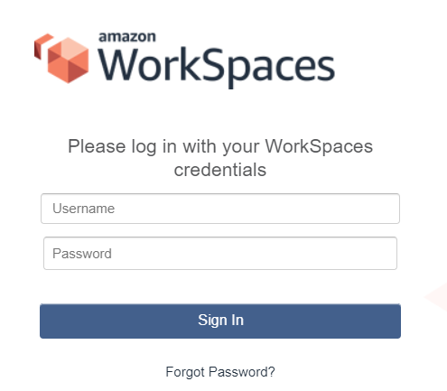
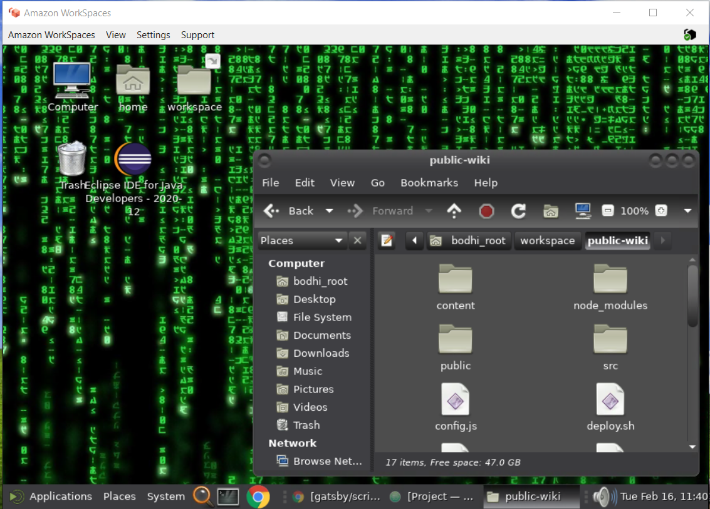

## Motivation

For several years now I've looked for a good solution for a "desktop in the cloud."  My primary motivation has been my lack of a good development machine.  I spend most of my time on my work laptop (which is really not supposed to be used for personal projects).  Rarely, I'll work on my office computer - which is setup more for family use than for software development projects.  My work laptop is a good machine, but it's main problem is it's setup to use the corporate proxy.  This means that many of my core development tools (Eclipse, Maven, git, Node/NPM) all have to be setup to use that proxy as well.  That proxy is a pain in the ass.  Turning it off can also be troublesome because you have to turn it off on every app, and failure to do this can result in some pretty bad behavior.  Sometimes a simple "mvn install" or "npm install" can download hundreds of corrupt files if you don't have your proxy settings set just right.

In addition: there are times where you just want to develop on a Linux machine rather than Windows. Wouldn't it be nice when you're building a Gatsby website to just follow the tutorial and have it work without having to go down all the rabbit holes for how to get it to work on Windows?  I've heard the Windows Subsystem for Linux (WSL) makes development tasks like this easier on a Windows machine, but of course my company has disabled that on our machines.

Lastly, wouldn't it be cool to be able to login from multiple machines and get the same development experience?  Whether I'm connecting from my work laptop of my office desktop, it would be awesome to have the same environment, setup with development tools ready to go, and the same code available right where I left off.  This is the dream that a desktop in the cloud would provide.

To summarize, the benefits of desktop in the cloud are:

1. No more developing personal projects on your work computer
2. No annoying corporate proxy (even if you connect to it from your work machine)
3. Native Linux experience (or you could still use Windows, if you prefer)
4. Connect from anywhere / any machine

## Past Attempts

In the past I've tried to setup remote desktops - primarily in GCP.  It's easy enough to spin up a Windows machine and connect to it using RDP.  It's also not too difficult to spin up an Ubuntu or Debian system and connect using VNC.  I have had some problems with the latter though.  The graphics experience hasn't been great.  One reason for this is that most remote systems don't have graphics cards and aren't really intended to be used as desktops).  I've also had problems where I've installed software on RedHat or Debian and it just doesn't work correctly through VNC.  An example of this is Anaconda - which I use for data science projects.  It installed just fine, but when I went to type the key mappings were all messed up.  I'd type one character and another would appear on the screen.  Then you start digging into your VNC, and X settings trying to figure out what's wrong, but those are painful.  I never did figure out how to solve that particular problem.

## AWS WorkSpaces

Just this past month I decided to try AWS WorkSpaces.  I had read about it a lot.  In the past I had held off from using it because I know it won't work through the corporate proxy.  However, after almost a year of working at home, I can easily hop off the corporate proxy and onto my personal network whenever I'd like.  So it seemed like a good time to give it a try.

I was a bit disappointed that Ubuntu and Debian weren't options for the OS.  These are the systems that Google developers use, and I was wanting to get more comfortable with them.  The only Linux system they offer is a custom AWS Linux 2 image.  This is based off RedHat/CentOS, so the core tools aren't even the same as Ubuntu/Debian.  But that's OK.  Let's keep going.

I was easily able to stand up a "Standard" machine with 2 vCPUs, 4 GB RAM, and 80 GB of space on a root volume, and 50 GB on a user volume.  If I were to run this all month the cost would be $31.  I don't expect to use it that much, so I instead pay the hourly price: $9.75/month + $0.26/hr.  The only tricky part about the initial workspace provisioning is that it tells you to wait for an email with your login information.  It doesn't tell you that it doesn't always send this email automatically.  In my case, I had to go in to the management settings and manually send the email to myself with login information.  Then it was easy enough to get in and view my machine.



One interesting feature is that I don't use my root AWS account to login.  Instead, I create a new account as part of the workspace provisioning.  This generates a registration code that ties to my provisioned workspace.  When I sign in on the form above it knows to take me to my specific workspace.  I don't yet know what happens when I have two workspaces provisioned to the same account.  Maybe I get a chance to pick which one after I login?

Off the bat, one really cool thing about AWS WorkSpaces is that when I login it immediately boots up my server, and it does it pretty quickly - within a minute or so.  Also, when I logout it automatically shuts my workspace down after an hour of inactivity.  Sure, I could go in and manually shut it down and save $0.26 for that hour, but so far I haven't.  I actually find this experience so much easier than in GCP when I had to login to the GCP console, start my server, then connect to it, and then manually shut it down again or else risk having days of usage costs appear on my bill instead of hours.  Already, this is a big win for WorkSpaces.

The next big win comes when I realize how fast the rendering is.  I can even watch videos on YouTube and they stream back pretty well.  This is the big reason I wanted to try WorkSpaces.  The optimized client uses a PCoIP protocol to stream back pixels as they change on the remote screen.  It also features a lossy compression algorithm that can stream back the basic picture (with some fuzziness) at first if bandwidth is limited and then quickly clarify the picture with additional detail over the next second or two.  This provides a similar experience to RDP on Windows, but it's a big step ahead of VNC on Linux.

## Configuration



As I settled in to use my new workspace, I had to install quite a few things.  Some quick notes on what it took to get my development environment going are included below:

### Install chrome:

1. Download rpm
2. Run: ```sudo yum install <file>```
3. Add applications/google-chrome to taskbar

### Change Theme:

1. Change theme to BlackMATE
2. Change wallpaper

### Install Eclipse

1. Download installer (.tar.gz)
2. Extract and run ```eclipse-inst``` (installs to ~/eclipse)
3. Change theme to dark

### Install Atom

(simple download from website)

### Install Node

https://docs.aws.amazon.com/sdk-for-javascript/v2/developer-guide/setting-up-node-on-ec2-instance.html

### Install Yarn

Run: ```npm install yarn -g```

### Install docker

```
sudo yum install docker
sudo systemctl start docker
sudo usermod -aG docker $USER
```

(you'll need to log back in with "sudo - su $USER" for group to take effect)

### Install Google Cloud SDK:

https://cloud.google.com/sdk/docs/install#rpm

```
sudo yum install google-cloud-sdk
gcloud init
```

## Final Thoughts

I've been using this setup for about a month now, and I have to say I like it a lot.  It definitely is better than trying to stand up a VM from scratch.  The automatic starting and stopping of the VM is a big advantage.  The way everything "just works" is a big selling point. I haven't had any weird key mapping type issues.

Also, one day I learned about the backup and restore features of AWS WorkSpaces which are a great benefit.  In case you do something dumb like I did (corrupting my sudo users file so that no one was able to sudo anymore), AWS takes snapshots of your VM every 12 hours.  You can easily restore to your last snapshot from the AwS console.  I made sure to push all my code to GitHub first before doing this, so I didn't lose any of my work from that morning.  The restore took maybe 10-15 minutes, but then I logged back in and everything worked great.  For a moment there I thought I had corrupted my system and was going to have to start a new install from scratch, but that backup/restore feature is a life saver!

The only two problems I've really had with this are:

1. Occassionally I get disconnected.  This usually only lasts about 15 seconds, but it's annoying.
2. Sometimes I'll type a key once and see it repeated 2 or more times in the workspace.  This happens once an hour or so.

Both of these are annoying, but they aren't deal breakers.  The benefits of this solution still outweigh the costs and small annoyances.  I hate to admit that there have been times when I wished I was on a remote Windows system rather than Linux.  This is especially true when I just want to do some simple image manipulation in Paint or when I want to build a quick PowerPoint deck.  But when you're doing web development or even Java development, and you get to develop in a similar Linux environment as that where your code will eventually run... that's a huge benefit that I've enjoyed a lot.
