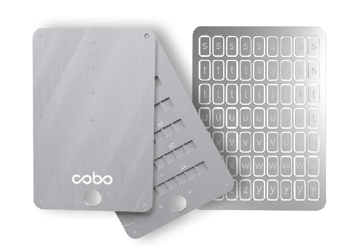
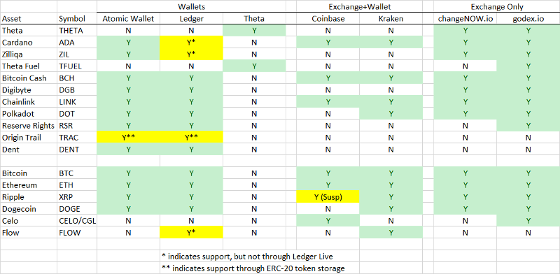

## Overview

This past week I met with someone who encouraged me to "up my game" when it comes to investing in crypto assets.  The only experience I have had involved trading on Coinbase Pro (formerly GDAX).  This exchange operates just like any other broker such as Fidelity or Robinhood.  You send them money to fund your account, and then you can buy and sell assets on their exchange using their website or mobile app.  You don't have to know anything about how the underlying assets are actually exchanged or worry about how they are stored in digital wallets.  The website takes care of that for you and advertises that 98% of their customers' assets are kept in "cold storage" where they are offline and safe from hackers.  This works fine for any assets that are traded on the exchange, but what about crypto coins and tokens that aren't traded on Coinbase (or Coinbase Pro)?  This is where you have to go a bit off of the mainstream trail, but then again... that's where you usually need to go if you want to make real money.

The advisor walked me and my dad through his own experience trading crypto assets and showed us the tools he used to accomplish the job.  This included:

1. __Coinbase Account__ - An online wallet that is easy to fund from a bank and also lets you buy/sell various crypto coins
2. __Atomic Wallet__ - A software-based wallet that allows you to take ownership of your crypto assets and manage them yourself
3. __Theta Wallet__ - An online wallet for THETA and TFUEL.  (This is the only way to store these assets.)
4. __Ledger Nano X__ - A hardware-based wallet that allows you to store crypto assets and secret keys
5. __Cobo Steel Tablet__ - Used for secure seed-phrase storage
6. __Decentralized Exchanges__ - A way to exchange cryptocurrencies without having to create an account on a specific exchange.  https://changenow.io/ and https://godex.io are two examples we used, each supporting a wide variety of assets
7. __CoinMarketCap Account__ - A nice way to monitor crypto prices and keep track of your portfolio in one place

Each tool serves a purpose, and since I love taking notes and am always afraid of forgetting something, I will document each of these below.  My goal was to reproduce the portfolio below using these tools:

| Asset          | Symbol | Description                    |   % |
|----------------|--------|--------------------------------|----:|
| Theta          | THETA  | Decentralized video streaming  | 40% |
| Cardano        | ADA    | 3rd generation smart contracts | 15% |
| Zilliqa        | ZIL    | Smart contracts                | 15% |
| Theta Fuel     | TFUEL  | Fuel for the Theta platform    |  7% |
| Bitcoin Cash   | BCH    | Bitcoin competitor with 1000x faster transaction speed      |  5% |
| Digibyte       | DGB    | More secure payment system for corporations and governments |  5% |
| Chainlink      | LINK   | "Oracle service" to provide inputs to smart contracts       |  4% |
| Polkadot       | DOT    | Enables connections between different blockchain networks   |  3% |
| Reserve Rights | RSR    | Coin used to support the RSV stablecoin                     |  1% |
| Origin Trail   | TRAC   | Supply chain tracking          |  1% |
| Dent           | DENT   | ?                              |  1% |

## Coinbase Account

Coinbase (https://www.coinbasecom) is a popular, secure online wallet for storing crypto currencies.  It is relatively easy to fund a Coinbase account from your bank account.  You can also buy and sell crypto assets here.  My dad was able to create an account, upload some funds, and buy Bitcoin Cash (BCH) the first night after talking to this advisor.  It turns out I already had a Coinbase account back from when I setup my Coinbase Pro account.  In fact, I even had $75 of crypto in there that I had no idea about.  It looks like these arrived from various "air drops" based on my holdings of Bitcoin.

Personally, I think I prefer Coinbase Pro (https://pro.coinbase.com) since it supports almost all the same coins and allows you to purchase them using limit orders.  My dad was charged a little over a 1% fee for his BCH purchase whereas the max fee on Coinbase Pro is 0.5%.  Coinbase Pro also supports Cardano (ADA), Bitcoin Cash (BCH), and Chainlink (LINK), checking 3 of the cryptocurrencies off my list.

It is advised that you not keep any long-term assets in Coinbase or Coinbase Pro though.  Unless you expect to trade them frequently, we were advised to move them to our own digital wallets where we would take physical possession of the coins.  Atomic Wallet and/or the Ledger Nano X were suggested for this.  These will be covered next.  NOTE: If you upload money to Coinbase, you will have to wait 8 days before you can move it out of that wallet and into your own digital wallet.

## Atomic Wallet

Atomic Wallet (https://atomicwallet.io) is a program you can download and run on your computer (or on your phone via the mobile app) that lets you manage your own digital wallet with support for over 300 different cryptocurrencies.  The program is free and open source.  When you install it, it will ask you to create a password.  It will then generate a set of 12 random words that protect your crypto assets.  These 12 words are a "seed phrase" that is used to generate all of the public/private key pairs that your wallet uses for the various forms of cryptocurrencies.  The first password you generated is actually used by the software to secure these 12 words, but these 12 words are the key to your entire wallet.  If you have them, you can restore you wallet on another device.  If you lose them, you will lose all access to your crypto coins permanently, and no one will be able to help you recover them.

We were advised to store our 12 word seed phrases in a Cobo Steel Tablet (https://shop.cobo.com/products/cobo-tablet-plus).  This is a metal device, about the size of a credit card, that lets you secure letters into place in a steel case in a way that the words should last forever and are even fire proof.  We'll talk more about this later, but for now just write down your 12 word seed phrase somewhere safe.

One important question you'll have to answer is: where do you want to install Atomic Wallet?  We were advised to store it on a special computer that is only used for this purpose and which can be turned off and disconnected from the internet when not in use.  This would essentially turn your software-based wallet into a hardware-based wallet, keeping it off the internet and free from hackers or computer viruses.  I thought the idea of a dedicated computer was a bit overkill, but I was intrigued by the idea of using a computer in the cloud for this purpose.  I ended up creating a VM in Google Cloud for this purpose.  It is a brand new computer that will only be used for this one purpose, and I can shut it down when it's not in use.  Google Cloud is a cost-effective way of doing this since the computer only costs about $0.05 per hour to run and a few cents per month to store the disk image.  The disk image is also encrypted at rest.  Basically, I am trusting Google to protect my digital wallet.  And I'm guessing that a hacker would be unable to hack into GCP, pick out my VM from the millions out there, start it up, and then hack into that computer.  As long as my Google credentials and the credentials for that VM are kept secure, this seems like a good way to protect my assets.  Much safer than the other options I had on hand: my work laptop (which seems like a work "no-no"), my family PC (which I always fear has spyware on it), and my phone (which is always online and thus always prone to hacking).

Anyway, back to Atomic Wallet.  Once this is installed you can very easily transfer digital assets to and from your various wallets.  You simply click on the wallet you want use, and then click the "send" or "receive" button.  The "send" button will ask you for an address to send funds to.  The "receive" button will provide your address that you can provide to anyone who wants to send money to you.  I used this feature to transfer Bitcoin (BTC) from Coinbase Pro to Atomic Wallet.  I transferred $2k at first, just to test it out, and once I was sure it arrived, I then transferred another $13k.

Next, I wanted to use this money to buy the various other assets on the list.  While Atomic Wallet does support trading assets, it doesn't provide much support for starting with BTC and buying other assets.  Instead, I had to head over to the decentralized exchanges (https://changenow.io and https://godex.io/ to make the next transactions.  We'll come back to these in a moment after a brief chat about the hardware wallet Ledger Nano X.

Also, while I will only touch upon the subject very quickly: Atomic Wallet supports "staking" some of the coins in your wallet.  This means loaning them out to others who can use them to run nodes in various networks.  The recipients will pay interest in exchange for their use of your tokens.  This can only be done with select coins, but Zilliqa (ZIL) was returning 15% interest and Cardano (ADA) 5% when I set this up.  Once I did get ZIL in my wallet, I staked it all.  It disappears from your wallet and appears in the "Staking" section instead.  It also takes about 2 weeks to "unstake" these coins when I wish to withdrawal them.

## Theta Wallet

Theta (THETA) and Theta Fuel (TFUEL) are two assets that were key to the portfolio I was building.  However, these can only be stored in one place: an online Theta Wallet at https://thetatoken.org.  You create a password for this wallet and it generates a 12-word seed phrase in the same way as Atomic Wallet.  Write this down, and keep it in a safe place.  It will also generate a "keystore" file that you can download to your computer.  In the future, you will be able to access your wallet with any of the following:

1. Your password + keystore file
2. Your 12 word seed phrase
3. A USB device like the Ledger Nano X that can provide your credentials

Options 2 and 3 come with warnings to unplug your computer from the internet when you use them.  As such, option #1 is probably the safest.

Once you login, you can view the contents of your wallet.  It also offers simple "send" and "receive" operations that provide the same capabilities as in Atomic Wallet: the ability to send THETA or TFUEL to other accounts and the ability to pull up your own wallet address so others can send these to you.

There is a section in the Theta wallet for "staking" theta.  However, this isn't as easy as Atomic Wallet, where you are staking to some collective pool.  This is instead intended for people who actually want to run a Theta node on the network. In this case you need Theta tokens to run the node and it will generate TFUEL to put into your account.  The "staking" button will ask you for identifying information of your node to set this all up.  This is not something I plan to do.

## Ledger Nano X

The Ledger Nano X is one of the premier hardware-based wallets for storing cryptocurrencies and other credentials you might use.  It supports 27 coins and over 1500 tokens.  You plug it into your computer through a USB port.  In addition to coins it can also store credentials for your Theta wallet, allowing you to plug it in as a way to verify your identity with the website.

Ultimately, I decided this was not a device that I needed.  I like the Atomic Wallet better, and as long as I keep my credentials and seed phrase safe, I don't think the Ledger offers much more in the way of security.  In fact, the Ledger seems like a bit of a pain, and also a bit or a risk in that I'm assuming the device will continue to function properly and that I will be able to receive support from this company for the next few years.

## Cobo Steel Tablet

We mentioned earlier that a 12-word seed phrase is used to protect your Atomic Wallet and Theta Wallet.  The Cobo Steel Tablet is a way to keep this phrase safe.  It is fireproof and virtually indestructable.  It comes with metal letters you can arrange into words, and then it locks down to keep those words safe.  It can be purchased here: https://shop.cobo.com/products/cobo-tablet-plus.  While researching this I also found that the tablets only store the first 4 letters of each word.  It is said that this is all you need to recover your wallet.

This was all very new to me.  The geek in me had to dive a little deeper into this.  It turns out the words are drawn from a special vocabulary called BIP39.  There are 2,048 words in this vocabulary and the first 4 letters of each word are unique.  This means that you only need those first 4 letters to uniquely identify the word.  These words can be turned into a variety of public/private key pairs - one for each crypto asset - using a standard derivation algorithm ([BIP44](https://github.com/bitcoin/bips/blob/master/bip-0039.mediawiki)).  Anyone who has these 12 words can take complete control of your crypto wallets.  If you were to install Atomic Wallet on another computer, you could provide these 12 words at startup and it would generate the same public/private key pairs, and hence the same wallets as before, allowing you access to these wallets on the new computer.  Atomic Wallet advises you to use different protective passwords on different installations of its software (i.e. a different password on your phone than on your PC), but the 12 word seed phrase will be the same for all installations.

Our adviser said we would need 2 of these: one for Atomic Wallet and one for our Theta Wallet.  He emphasized that these 12 words should never be shared with anyone or stored anywhere where people could see them.  You should avoid storing them on a computer and even typing them into your computer for fear of keyloggers.  He advised putting them in the Cobo tablet and then putting that in a safe.  Some people say even the safe might be a bad idea because home burglars could steal the entire safe assuming it has valuables in it.

## Decentralized Exchanges

Alright, if you've been following along so far you should be equipped to do the following:

1. Create a Coinbase (or Coinbase Pro) account and fund it with money
2. Create an Atomic Wallet on a safe computer
3. Create a Theta Wallet online at https://thetatoken.org
4. Store the 12-word seed phrases for both of these wallets in a Cobo Steel Tablet to keep them secure

We also mentioned that we can transfer Bitcoin (BTC) to our Atomic Wallet but that we ran into some problems changing that into the other cryptocurrencies that we wanted to store.  So... how the heck do we go about doing that?  This is where the decentralized exchanges come in to play.

Let's start with ChangeNOW (https://changenow.io).  When you navigate to this website you'll see an input form like this:

You input the amount of crypto you want to change and the target currency, and it provides the exchange rate.  When you click the "Exchange" button it takes you to a second screen that once more shows the exchange rate, but this time also includes a field to enter the destination wallet:

This is where you enter your wallet as the destination.  In the example above, the target coin is ZIL, so you will provide the address of your ZIL wallet.  When you click "Next" it will provide you with a Bitcoin address to which you can send funds to initiate the transaction.  Once you send the Bitcoin to that address, the website will do the rest, converting your Bitcoin to ZIL and sending it to the destination wallet.  They say this takes about 10 minutes, but in my experience it only took about 3 minutes.

Now, one tricky thing about these exchanges is that they don't make their processing fee explicitly obvious.  The truth is that they are making money on every transaction, but they build their fee into the exchange rate so you can't easily see it.  The only way to know what kind of fee you are being charged is to find the current prices of both cryptos and do a little math.  I've automated this using a simple spreadsheet:

In the example screenshots we are trading about $5,631.56 worth of Bitcoin and receiving $5,555.62.  The difference of $74.94 (or 1.35%) is the fee that we are being charged on this exchange.  It's worth looking at these fees before processing your transaction because some of them can be quite high.  (If I did the math right then godex.io charged me over 6% on a BTC to TFUEL transaction.)

Godex (https://godex.io) is another anonymous, decentralized exchange that supports even more tokens that ChangeNOW.  I've only used this for TFUEL, but I didn't like it as much.  It charged me a much higher commission on my transaction.  It also took longer to complete.  In fact, the verification of my deposit to their address took so long (about 5 minutes) that I was worried I had sent my Bitcoin to the wrong address.  But for tokens like TFUEL that aren't supported by ChangeNOW, this is one place to get them.  The setup is the same as ChangeNOW.  You enter what you want to trade and the destination wallet address.  They provide an exchange rate.  Then they give you a wallet address to which you can deposit funds to start the transaction.

Overall, these decentralized exchanges are nice, simple ways to exchange coins of one type for another.  They work well enough.  However, I suspect the fees are much higher than you'd find on a regular exchange like Coinbase Pro, Kraken, or Binance.

## Summary of What is Available Where

As you might infer, it can be tricky to keep track of what tokens are supported by which exchanges and what wallets.  I made the following table to help me understand this:

You'll notice a caveat around the storage of the TRAC token.  This is an ERC-20 token, meaning it is actually implemented as a contract on the Ethereum blockchain.  ERC-20 is the standard that all Ethereum-based tokens must implement.  There are over 200,000 ERC-20 tokens, and they are supported by wallets like Atomic Wallet, but in a slightly different way.  In Atomic Wallet, you will have to click the "+" symbol to add a new asset and navigate to "Add Ethereum Token -> Add by Contract".  Then you can base TRAC's contract address on the top line and everything else should populate for you.  You'll have to lookup the contract address, but it should be readily available on Google.  I was also told that I would need to use Uniswap and a MetaMask wallet to exchange TRAC.  I don't know what either of these are and have not gone down this road.  

To summarize my final positions, I ended up storing my cryptocurrencies in the following locations:

* Coinbase Pro: Bitcoin (BTC), Cardano (ADA), Bitcoin Cash (BCH), Chainlink (LINK), Celo (CGLD)
* Atomic Wallet: Bitcoin (BTC), Zilliqa (ZIL), Digibyte (DGB), Pokadot (DOT)
* Theta Wallet: Theta (THETA), Theta Fuel (TFUEL)
* Robinhood: Bitcoin (BTC), Ethereum (ETH), Doge (DOGE)

Normally, I wouldn't recommend storing anything in Robinhood.  I only did it because I already had some money there that wasn't invested in anything.  I also only bought Dogecoin as a joke - just in case the Wall Street Bet gorillas manage to push it up to $1.00.

I tried my best to stick to the principal of: a dedicated location for each type of coin.  That is, I don't want to store Cardano in two places.  I picked Coinbase Pro for Cardano, and that's where I'll try to keep it.  However, I did notice that Atomic Wallet allows you to "stake" Cardano and earn 5% interest.  So maybe I should make Atomic Wallet my primary storage location for this particular asset.

In order to keep track of this I created a spreadsheet detailing how much of each asset I had in each location.  This provided a nice record for me to make sure I know what I have and where it is stored.  However, manually updating a spreadsheet is not the best way to track the value of your portfolio.  Instead, we'll bring in one last tool for that: CoinMarketCap.

## CoinMarketCap

CoinMarketCap (https://coinmarketcap.com) is a website where you can track the price of various cryptocurrencies.  You can also create a free account to build a watchlist of select assets or to build a fake portfolio.  The latter is the best way to track the value of your portfolio in realtime from any location without having to ever open up a spreadsheet or having to open your wallets or exchange accounts.  You can simply build a portfolio on their website that contains your same holdings and then login to the website to see how you're doing.

When you buy or sell cryptocurrencies you can add transactions on the website to record this.  Exchanging one cryptocurrency for another is a bit tricky.  The website can only log this exchange as:

1. Selling one asset for cash
2. Buying another asset for cash

If you know the exact amounts of each asset this isn't too hard to do.  The cash amount doesn't really matter either.  It is only used to track total gain/loss on your investment so as long as it's close it should be OK.  The amount of each asset you hold is what matters.  Also it helps to log the 2 transactions as occurring at the same time.  This way there is a smooth transition when your portfolio value is plotted overtime instead of seeing a sharp increase and decrease.

## Conclusion

This has been a long entry and has covered a lot of ground.  I think I've captured just about everything I've learned in the past few days about these tools and trading techniques.  I have opened an Atomic Wallet and a Theta Wallet and transferred coins to each of these.  I have used the decentralized exchanges (changenow.io and godex.io) to exchange some of the more exotic coins.  I'm still looking for a better exchange though that will be more transparent on their fees - something like Kraken or Binance.  Binance looks great, but it banned US customers a while ago and not all of the coins are supported on the US website (binance.us).  I'm also going to order the Cobo Steel Wallet and find a safe place to save my seed phrases and passwords.  (Hopefully those seed phrases plus this instructional page explaining what I did will be enough to help someone recover these assets in the event of my untimely demise.  I'd hate to build a fortune in cryptocurrencies and have it be one of those that gets lost forever because no one knows how to get at it.)

I built a CoinMarketCap portfolio to easily track my portfolio value.  I'll admit, I've been checking it every few hours these past couple of days.  It's hard not too.  Cryptocurrencies are like a rollercoaster ride: you go way up and then you go way down (and hopefully way back up again).  It's a fun ride.  But it would probably be an easier ride if I didn't watch it so closely and just let it go.  I don't plan to sell these assets anytime soon.  In order to get preferential tax treatment I should hold them for at least 1 year.  I'm trying to think of them the same way as I did my original investment in Bitcoin: in 10 years it might be worth a lot, or it might be worth absolutely nothing.  Let's just HODL and check back in a few years to see how it's going - which is much easier said than done.
